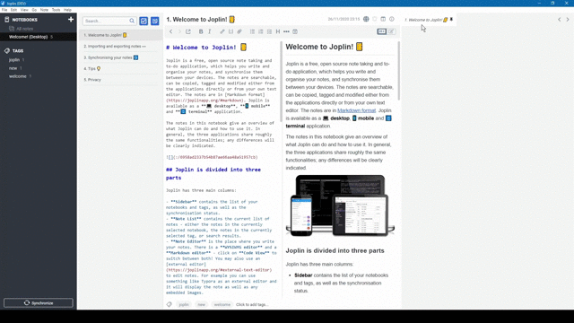
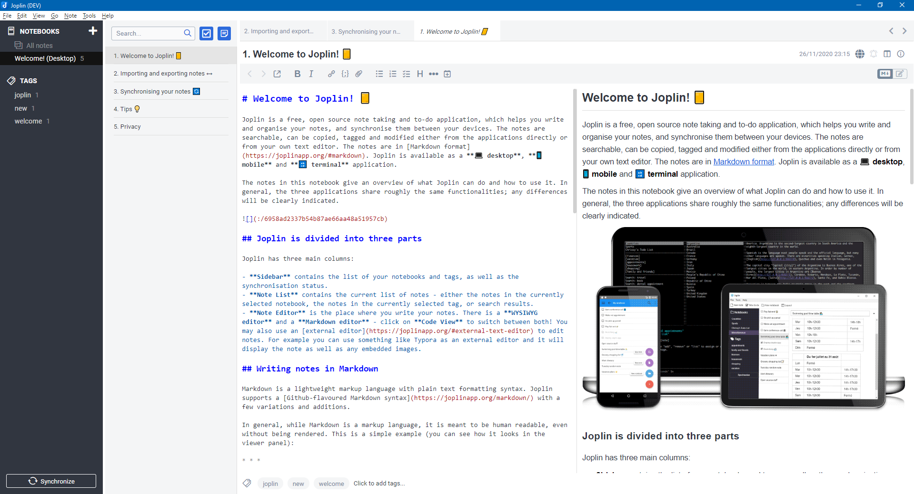
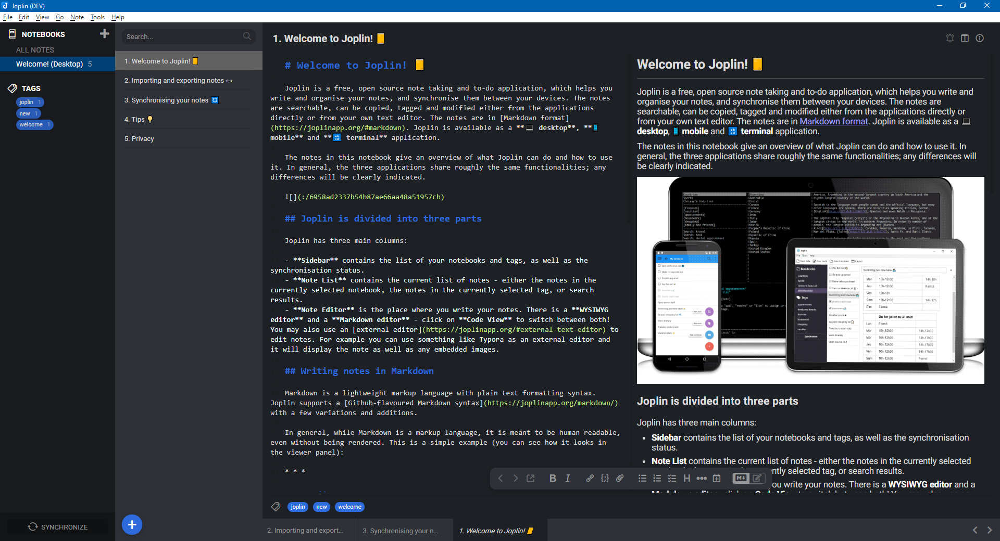
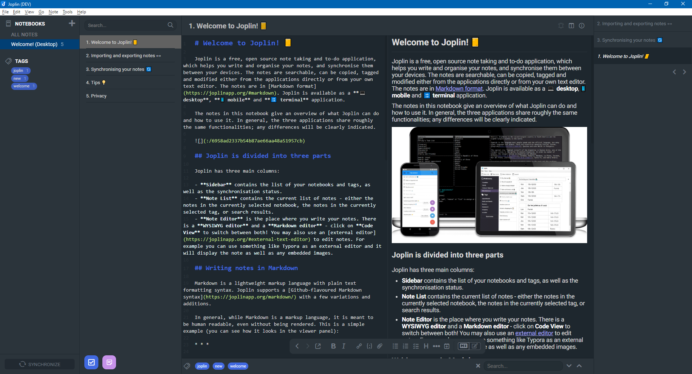

# Joplin Note Tabs

Joplin Note Tabs is a plugin to extend the UX and UI of [Joplin's](https://joplinapp.org/) desktop application.

It displays the selected note in a tab panel and allows to pin/unpin notes as tabs.

> :warning: **CAUTION** - Requires Joplin **v1.4.16** or newer

> :construction: **BETA** - This is a development version at a very early stage. Please make a backup copy of the user data (especially from the database) before using this plugin. I don't think that the plugin causes any damage to the database, but unfortunately I can't rule it out completely. I neither have the time nor the possibilities to test all possible use cases.

## Table of contents

- [Features](#features)
  - [Screenshots](#screenshots)
  - [Commands](#Commands)
  - [User options](#user-options)
- [Installation](#installation)
- [Uninstallation](#uninstallation)
- [Feedback](#feedback)
- [Development](#development)
- [Changes](#changes)
- [License](#license)

## Features

- Display selected note as tab
  - Remember last opened and unpinned note
- Pin/Unpin selected note to/from the tabs
- Change position of pinned tabs
- Toggle to-do state from tab
  - Automatically unpin completed to-dos ([configurable](#user-options))
- [Configurable](#user-options) style attributes
- Support horizontal and vertical layout



## Screenshots

### Tabs above note content



### Tabs below note content



> **NOTE** - The used UI theme on this screenshot can be downloaded [here](https://github.com/benji300/joplin-wanaka-ui).

### Tabs beside note content (vertical layout)



> **NOTE** - The used UI theme on this screenshot can be downloaded [here](https://github.com/benji300/joplin-milford-ui).

### Commands

This plugin provides the commands as described in the following chapters.

- Default keyboard shortcuts can be changed in user options
  - Navigate to `Tools > Options > Keyboard Shortcuts` and search for the command label to be changed

#### Tabs: Pin note (`tabsPinNote`)

| Command Label  | Command ID    | Default Key | Menu           |
| -------------- | ------------- | ----------- | -------------- |
| Tabs: Pin note | `tabsPinNote` | -           | `Tools > Tabs` |

Pin the selected note to the tabs.

#### Tabs: Unpin note (`tabsUnpinNote`)

| Command Label    | Command ID      | Default Key | Menu           |
| ---------------- | --------------- | ----------- | -------------- |
| Tabs: Unpin note | `tabsUnpinNote` | -           | `Tools > Tabs` |

Unpin the selected note from the tabs.

#### Tabs: Move tab left (`tabsMoveLeft`)

| Command Label       | Command ID     | Default Key | Menu           |
| ------------------- | -------------- | ----------- | -------------- |
| Tabs: Move tab left | `tabsMoveLeft` | -           | `Tools > Tabs` |

Move pinned and active note tab one position to the left.

#### Tabs: Move tab right (`tabsMoveRight`)

| Command Label        | Command ID      | Default Key | Menu           |
| -------------------- | --------------- | ----------- | -------------- |
| Tabs: Move tab right | `tabsMoveRight` | -           | `Tools > Tabs` |

Move pinned and active note tab one position to the right.

#### Tabs: Clear all tabs (`tabsClear`)

| Command Label        | Command ID  | Default Key | Menu           |
| -------------------- | ----------- | ----------- | -------------- |
| Tabs: Clear all tabs | `tabsClear` | -           | `Tools > Tabs` |

Clear all pinned tabs.

### User options

This plugin adds the following user options which can be accessed via `Tools > Options > Note Tabs`.

- Automatically unpin completed to-dos:\
  _Select whether completed to-dos shall be automatically unpinned or not_

- Note Tabs height (px):\
  _Specify the heigth of all tabs in pixel_

- Minimum Tab width (px):\
  _Specifiy the minimum width of a single tab in pixel_

- Maximum Tab width (px):\
  _Specifiy the maximum width of a single tab in pixel_

#### Advanced options

> **NOTE** - All settings here must be specified as valid CSS attribute values, e.g. `#ffffff` or `rgb(255,255,255)`. Joplin internal CSS variables can also be specified with "`var(-joplin-background-color)`".

- Background color:\
  _Specifiy the background color of the panel_

- Active background color:\
  _Specifiy the background color of the active tab_

- Foreground color:\
  _Specifiy the main foreground color to be used for text and icons_

- Active foreground color:\
  _Specifiy the foreground color of the active tab_

- Divider color:\
  _Specifiy the color of the tabs divider (border)_

## Installation

- Download the latest released JPL package (`com.benji300.joplin.tabs.jpl`) from [here](https://github.com/benji300/joplin-note-tabs/releases)
- Open Joplin
- Navigate to `Tools > Options > Plugins`
- Click `Install plugin` and select the previously downloaded `jpl` file
- Confirm selection
- Restart Joplin to enable the plugin

## Uninstallation

- Open Joplin
- Navigate to `Tools > Options > Plugins`
- Search for the `Note Tabs` plugin
- Click `Delete` to remove the plugin from the user profile directory
  - Alternatively you can also disable the plugin by clicking on the toggle button
- Restart Joplin

## Feedback

- :question: Need help?
  - Ask a question on the [Joplin Forum](https://discourse.joplinapp.org/t/plugin-note-tabs/12752)
- :bulb: An idea to improve or enhance the plugin?
  - [Request a new feature](https://github.com/benji300/joplin-note-tabs/issues) or upvote [popular feature requests](https://github.com/benji300/joplin-note-tabs/issues?q=is%3Aissue+is%3Aopen+label%3Aenhancement+sort%3Areactions-%2B1-desc+)
- :bug: Found a bug?
  - File an issue on [GitHub](https://github.com/benji300/joplin-note-tabs/issues)

## Development

### Building the plugin

If you want to build the plugin by your own simply run:

```
npm run dist
```

Or run to create also the archives:

```
npm run release
```

## Changes

See [CHANGELOG](./CHANGELOG.md) for details.

## License

Copyright (c) 2020 Benjamin Seifert

MIT License. See [LICENSE](./LICENSE) for more information.
